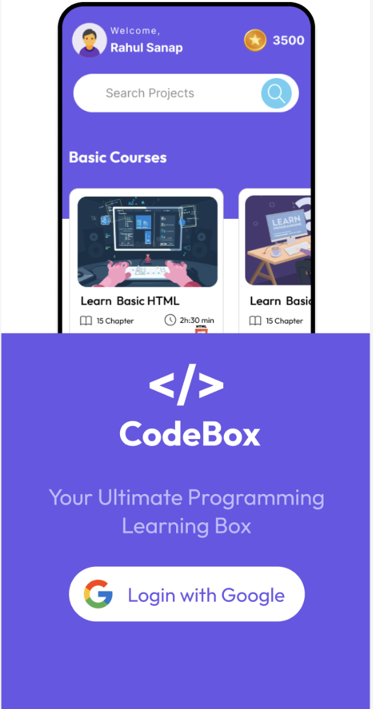
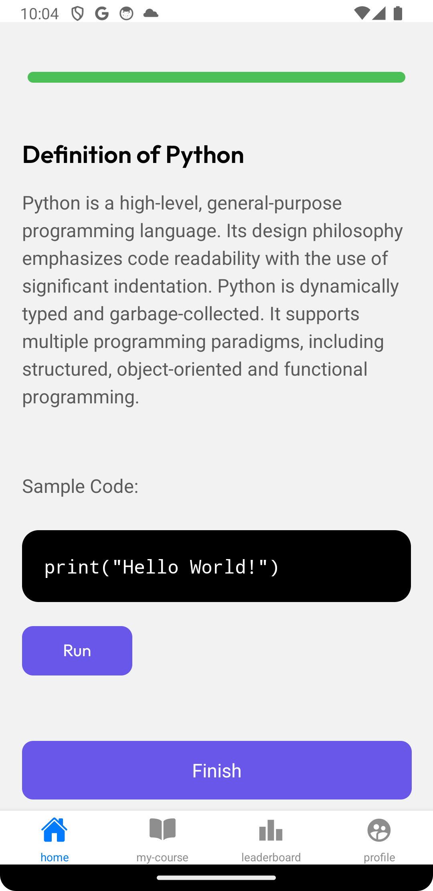
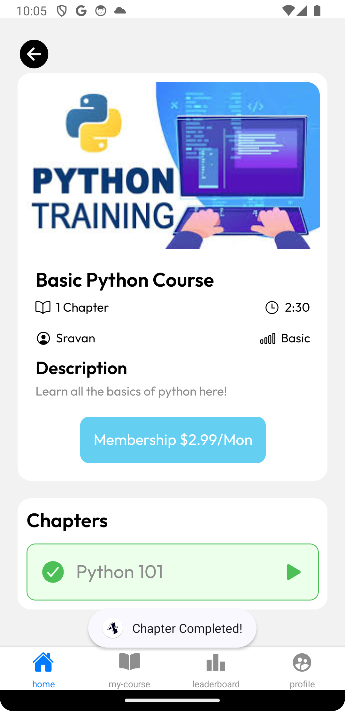
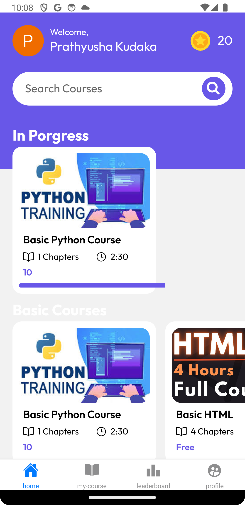
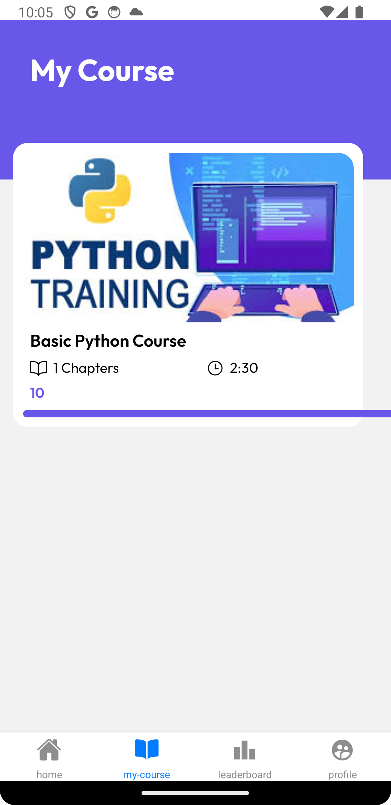
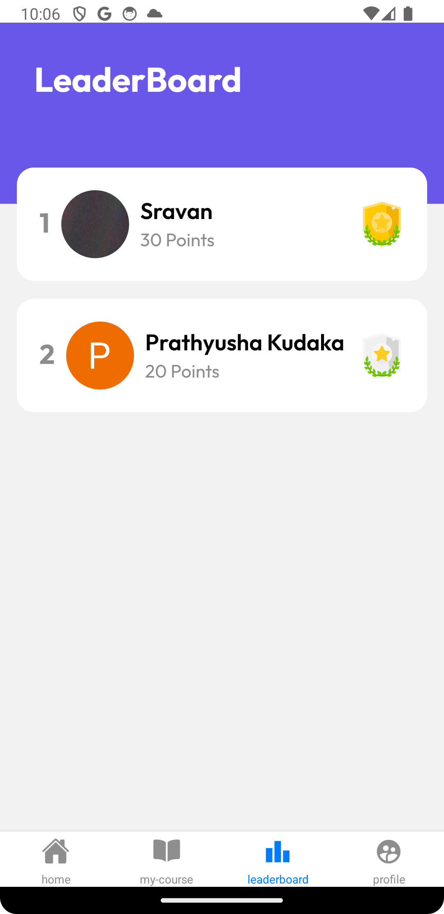

# Codebox-App

Welcome to the Codebox-App, an exclusive mobile application designed to enhance e-learning experiences. This application facilitates users with access to variety of courses, allowing them to register, login, enroll, learn and track their progress in a very convinient manner. 

# Team Information

Team Number: 52
Team Members:
1. Sai Sravan Anantapuram Bacherao
2. Sai Prathyusha Kudaka
3. Ramya Padidala

# Technologies Used
1. React Native
2. React Navigation
3. Expo
4. RESTful APIs

# Features

## User Authentication
Any new user can sign in securely with their email ID to access the app's features. After signing in, users are granted the access to utilize all the resources provided in the application. Using the APIs, user's mail ID along with profile picture and name is retrived and are visible on the home screen.

## Course Enrollment
Users are given the ability to sign up for whichever courses they like. Through RESTful APIs, the app retrieves course data from the backend so that users are able to explore and choose from a wide range of courses that are offered.

## Tracking of chapter completion 
The application also tracks the users progress in the course and helps user to keep of their day-to-day learning through this feature by marking the completed chapter. The user can also revisit the completed chapters. As soon as the user completes all the chapters a pop-up shows saying "chapter completed". 

## Display of the content
Users can view the content, that includes description of the courses, outputs when users run codes inside the excercises. The application uses React Native components to render all these courses and the content inside it dynamically in order to showcase the interactive learning experience. 

## Course Progress Monitoring
A progress bar allows all the registered users to keep track of their overall course progress. Users are presented with a visual representation of their progress by the progress bar component, which determines the proportion of completed chapters.

## Search bar
Users can make use of search functioanlity to search for all type of courses that they want to enroll and study

## User Profile
In the user profile the users can make changes in their profile, view the leaderboard, profile picture, and how many points they have earned.

## Leaderboard
A leaderboard function in the app allows users to see their rankings according to points gained. By finishing chapters and collecting points, here the users can climb the leaderboard and compete with other users.

# Video Demonstration
https://mailuc-my.sharepoint.com/:v:/g/personal/anantasn_mail_uc_edu/EX_6BJK4DDxHh0M2ZkDeuXwB_dtb3Ch2Us6zVjmixPmrrQ?nav=eyJyZWZlcnJhbEluZm8iOnsicmVmZXJyYWxBcHAiOiJTdHJlYW1XZWJBcHAiLCJyZWZlcnJhbFZpZXciOiJTaGFyZURpYWxvZy1MaW5rIiwicmVmZXJyYWxBcHBQbGF0Zm9ybSI6IldlYiIsInJlZmVycmFsTW9kZSI6InZpZXcifX0%3D&e=IZ6V3K

#   Screenshots

Below screenshot is the user login page, new user who wants to register can click on join with google and it takes you to the application Home page, where the user's profile picture, name is rendered automatically. 

Below screenshot demonstrates the Home screen of the application, in which there is search bar to search about the courses, at the right there is the information of the points earned by the user. and right below there is in progress section to see the courses that are already enrolled and are in progress. Under that you can see there are two different types of courses one is basic courses and the other is advanced courses.

As soon as the user clicks on advanced courses from home screen it navigates to the advanced courses screen through stack navigation and you can view it in the below screenshot. In this screen the description of the course is available and there is also option to enroll for free or the user can take the membership in order to gain more priveleges of the application. Just under it there is chapter information.

When the user clicks on basic HTML course section which the user have enrolled, it navigates to the screen shown in the below screenshot. Here you can see the user name, duration of the course, description of the course and the chapters present in the course.  

Inside the basic HTML course when the user clicks on the chapter 1, it navigates to the screen through stack navigation which is shown below. Here there is description and a code to run. 

As soon as the user completes the excercises chapter when the user reverts back, a pop up comes "chapter completed" and the chapter button turns to green. 

There are total four tabs in the application and the user can switch between screens through tab navigation. Below screenshot is showing the home screen where the HTML course under the in progress section, shows the course completion. 

The next tab is my-course tab where the user can see the completed courses and the below screenshot demonstrates it. 

The next tab is the leaderboard tab where the user can see their progress in learning courses and completion of the exercises,  keep track of their position in the leaderboard and compete with other users.

