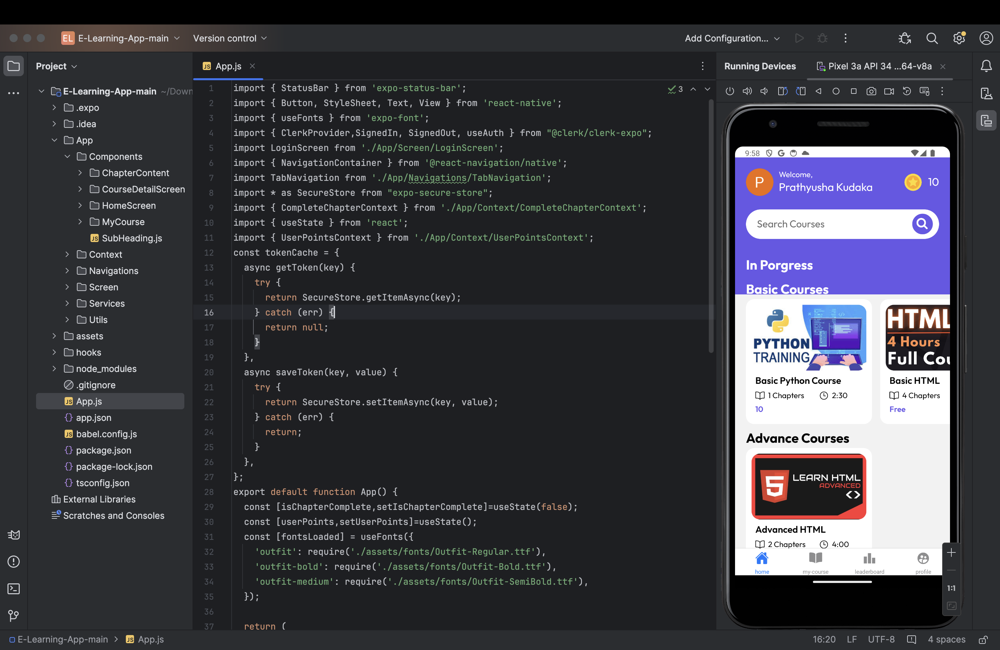

# Codebox-App

Welcome to the Codebox-App, an exclusive mobile application designed to enhance e-learning experiences. This application facilitates users with access to variety of courses, allowing them to register, login, enroll, learn and track their progress in a very convinient manner. 

# Team Information

Team Number: 52
Team Members:
1. Sai Sravan Anantapuram Bacherao
2. Sai Prathyusha Kudaka
3. Ramya Padidala

# Technologies Used
React Native
React Navigation
Expo
RESTful APIs

# Features

## User Authentication
Any new user can sign in securely with their email ID to access the app's features. After signing in, users are granted the access to utilize all the resources provided in the application. Using the APIs, user's mail ID along with profile picture and name is retrived and are visible on the home screen.

## Course Enrollment
Users are given the ability to sign up for whichever courses they like. Through RESTful APIs, the app retrieves course data from the backend so that users are able to explore and choose from a wide range of courses that are offered.

## Tracking of chapter completion 
The application also tracks the users progress in the course and helps user to keep of their day-to-day learning through this feature by marking the completed chapter. The user can also revisit the completed chapters. As soon as the chapter 

